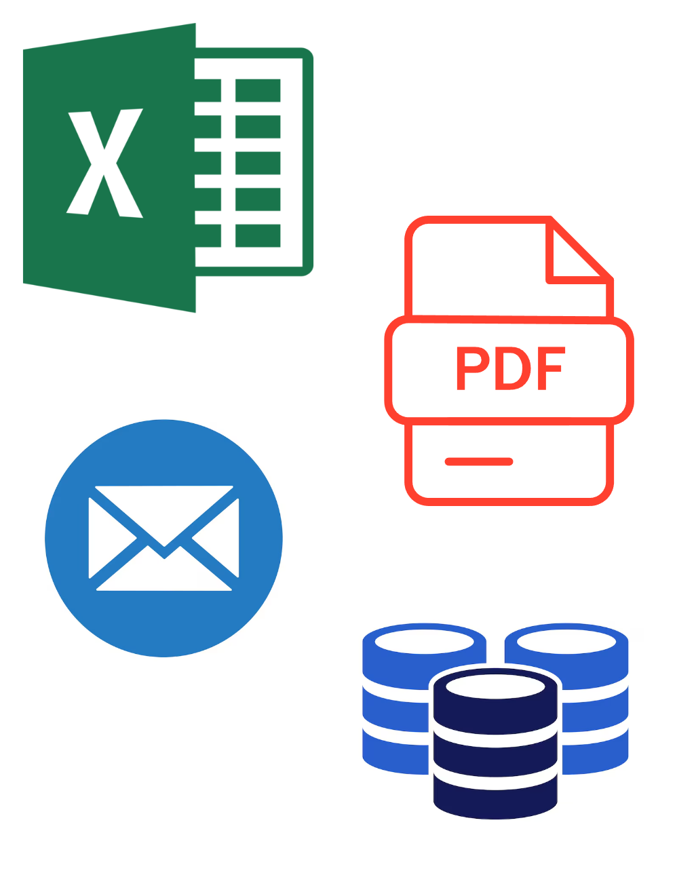
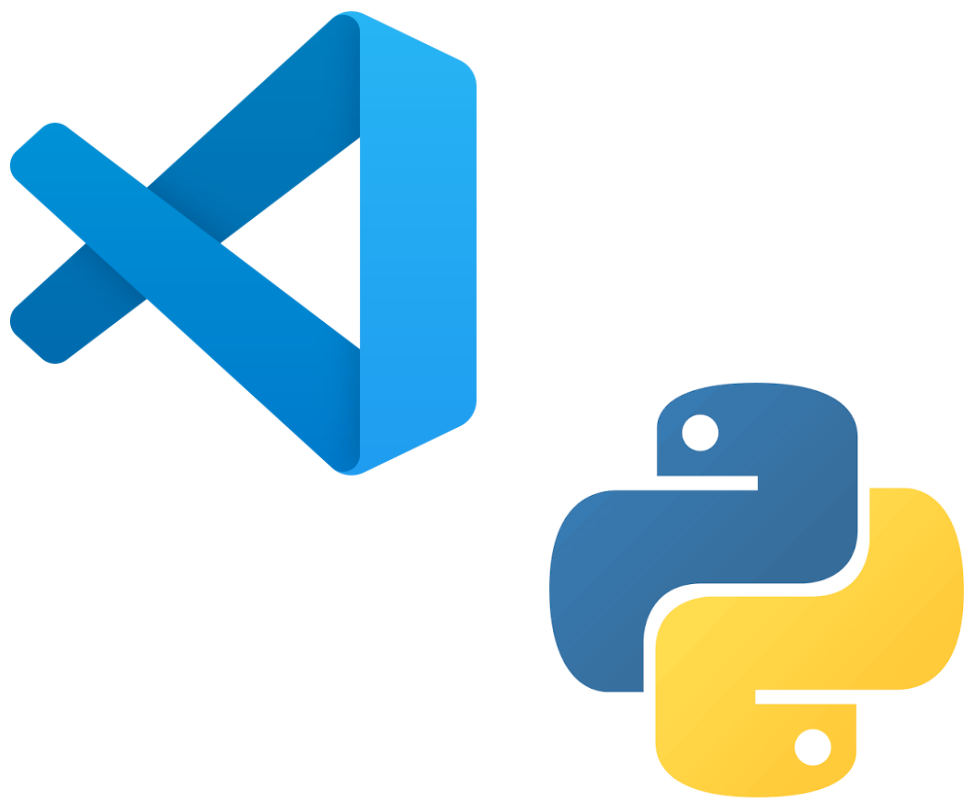

<!-- _class: title -->

# Introduction to Programming in Python

---
<!-- _class: chapter -->

# Chapter 1: Why Python? - The applications of the language

---
<!-- _class: columns subchapter -->

# 1.1. Software Development

- Game Development
- Cyber Security
- Scientific Computing
- Desktop Applications
- Data Analysis
- AI
- Web Development


---
<!-- _class: columns subchapter -->

# 1.2. Office Work

- Excel Integration
- PDFs
- Databases
- Sending emails



---
<!-- _class: subchapter two_col -->

# 1.3. Long-Term Career Goals

<div class="col">

- Web Development
	- Linux
	- HTML, CSS, JAVASCRIPT
	- HTTP, URLS, WEB SERVERS

</div>

<div class="col">

- Artificial Intelligence
	- Calculus
	- Linear Algebra
	- Probabilities
	- Statistics
	- Machine Learning

</div>

---
<!-- _class: chapter -->

# Chapter 2: Getting started!

---
<!-- _class: small-columns subchapter -->

# 2.1. Python Installation

<div class="first-column">

To use python in your computer you will need to install two things:

- **A Python interpreter:** To run your python code
- **A text editor:** To write your code. For us, that wil be **Visual Studio Code**

We will learn more about what a python interpreter shortly in this chapter.

</div>



---
<!-- _class: small-columns subchapter -->

# 2.1. Python Installation

1. Install python at the [python.org/downloads](https://www.python.org/downloads/)
2. Install **Visual Studio Code** at the [code.visualstudio.com/download](https://code.visualstudio.com/download)
3. Install the **python extension** in VSCode


---
<!-- _class: subchapter -->

# 2.2. Hello, World!

<div class="above" dir="rtl" lang="ar">

من التقاليد المتبعة عند البدء في تطوير المشاريع البرمجية أن يكون أول برنامج نكتبه هو برنامجًا بسيطًا يعرض الرسالة `!Hello, world` على الشاشة:

</div>


```python
print("Hello, python world!")
```

output:

```
Hello, python world!
```

---
<!-- _class: subchapter -->

# 2.2. Hello, World!

<div class="above" dir="rtl" lang="ar">

لنطلقِ نظرةً على ما يفعله `Python` عند تشغيل الملف `hello_world.py`.ينفّذ `Python` قدرًا معتبرا من العمليات، حتى عند تشغيل برنامج بسيط كهذا.

</div>

<div dir="rtl" lang="ar">

عند تشغيل الملف `hello_world.py`، تشير اللاحقة (File Type) `py.` إلى أن هذا الملف هو برنامج مكتوب بلغة Python. بعد ذلك، يقوم المحرر (Editor) بتشغيل الملف باستخدام مفسّر Python (Interpreter)، الذي يقرأ البرنامج ويحدد معنى كل تعليمة فيه. فعلى سبيل المثال، عندما يصادف المفسّر التعليمة `print` متبوعةً بأقواس، فإنه يعرض على الشاشة كل ما يوجد داخل تلك الأقواس.

</div>

---
<!-- _class: subchapter -->

# 2.3. The Python Interpreter & REPL

In your terminal where you ran `hello_world.py`, try the followoing commands:

- `python`
- `python3`
- `py`

<div dir="rtl">

إذا نجحت أيٌّ منها، فمن المفترض أن يتغيّر **موجّه الأوامر (Prompt)** في الطرفية إلى شكلٍ مشابه لما يلي:

</div>

```
Python 3.14.6 (main, Jun 15 2026, 11:36:54) [GCC 16.1.1 20260430] on linux
Type "help", "copyright", "credits" or "license" for more information.
>>>
```

---
<!-- _class: subchapter invisible-table -->

# 2.3. The Python Interpreter & REPL

That new prompt is called a **REPL**, meaning:

| | | |
|---|:---:|---:|
| **R**ead | $\rightarrow$ | قراءة |
| **E**valuate | $\rightarrow$ | تنفيذ |
| **P**rint | $\rightarrow$ | عرض النتيجة |
| **L**oop | $\rightarrow$ | التكرار |

<div dir="rtl" lang="ar">

يوفّر هذا الوضع طريقةً مباشرة للتفاعل مع مفسّر (interpreter) **Python** وتجربة مقاطع صغيرة من البرمجية. لواعدنا كتابة مثال `!Hello, World` الخاص بنا:

</div>

```
>>> print("Hello, python world!")
Hello, python world!
```

---
<!-- _class: subchapter -->

# 2.4. Data Types


You can add (+), subtract (-), multiply (*), and divide (/) **integers** in Python.

```
>>> 2 + 3
5
>>> 3 - 2
1
>>> 2 * 3
6
>>> 3 / 2
1.5
```
<div class="definition">

**Definition**

An **integer** is a signed number ((+) عدد صحيح, يحتمل ان يكون سالبا (-) او موجبا)

</div>

---
<!-- _class: subchapter -->

# 2.4. Data Types

<div dir="rtl">

تستخدم لغة Python رمزَي الضرب (**) لتمثيل عملية رفع العدد إلى أس (الأسس).

</div>

```
>>> 3 ** 2
9
>>> 3 ** 3
27
>>> 10 ** 6
1000000
```

<div dir="rtl">

تدعم لغة Python أيضًا ترتيب العمليات الحسابية، لذا يمكنك استخدام عدة عمليات في تعبير واحد. كما يمكنك استخدام الأقواس لتغيير ترتيب تنفيذ العمليات، بحيث يقوم Python بتقييم التعبير بالترتيب الذي تحدده. على سبيل المثال:

</div>

```
>>> 2 + 3*4
14
>>> (2 + 3) * 4
20
```

---
<!-- _class: subchapter -->

# 2.4. Data Types

```
>>> 0.1 + 0.1
0.2
>>> 0.2 + 0.2
0.4
>>> 2 * 0.1
0.2
>>> 2 * 0.2
0.4
```
<div class="definition">

**Definition**

Python calls any number with a decimal point a **float**. This term is used in most programming languages, and it refers to the fact that a decimal point can appear at any position in a number.

</div>

---
<!-- _class: subchapter -->

# 2.4. Data Types


But be aware that you can sometimes get an arbitrary number of decimal places in your answer:

```
>>> 0.2 + 0.1
0.30000000000000004
>>> 3 * 0.1
0.30000000000000004
```

When you divide any two numbers, even if they are integers that result in a whole number, you’ll always get a float:
```
>>> 4/2
2.0
```

---
<!-- _class: subchapter-->

# 2.4. Data Types

<div class="definition">

**Definition**

A string is a series of characters. Anything inside quotes is considered a string in Python.

</div>

You can use single or double quotes around your strings like this:
```python
"This is a string."
'This is also a string.'
```

---
<!-- _class: subchapter-->

# 2.4. Data Types

This flexibility allows you to use quotes and apostrophes within your strings:
```python
'I told my friend, "Python is my favorite language!"'
"The language 'Python' is named after Monty Python, not the snake."
"One of Python's strengths is its diverse and supportive community."
```

---
<!-- _class: subchapter-->

# 2.5. Variables

Let’s expand on this program by modifying hello_world.py to print a second message. Add a blank line to hello_world.py , and then add two new lines of code:
```python
message = "Hello Python world!"
print(message)
```

outputing once again:
```
Hello Python world!
```

Here, `message` is a variable. You can change the value of a variable in your program at any time, and Python will always keep track of its current value.

---
<!-- _class: subchapter -->

# 2.5. Variables

## Data Types of variables in Python
- **int:** Integers (-1, 0, 1, 2, 3, ...)
- **float:** Decimal values (1.5, 2.1, -7.9, ...)
- **str:** String of characters! ("Ilyas", "Cheese Burger", "1200 DA/Burger")

You can use underscores in large numbers
```
>>> universe_age = 14_000_000_000
>>> name = "Ilyas"
>>> grade = 15.6
```

You assign to multiple variables at once
```
>>> x, y, z = 0, 0, 0
```

---
<!-- _class: subchapter -->

# 2.5. Variables

- Variable names can contain only letters, numbers, and underscores. They can start with a letter or an underscore, but not with a number. For instance, you can call a variable `message_1` but not `1_message`.
- Spaces are not allowed in variable names, but underscores can be used to separate words in variable names. For example, `greeting_message` works, but `greeting message` will cause errors.
- Avoid using Python keywords and function names as variable names; that is, do not use words that Python has reserved for a particular programmatic purpose, such as the word `print`.

---
<!-- _class: subchapter -->

# 2.6. Function & Variables

now some functions:
```python
name = "ada lovelace"
print(name.title())
```

outputing:
```
Ada Lovelace
```

```python
print(name.upper())
print(name.lower())
```

This will display the following:
```
ADA LOVELACE
ada lovelace
```

---
<!-- _class: subchapter -->

# Comments

```python
print("Line 1")
# this is a comment
print("Line 2")
```

---
<!-- _class: subchapter -->

# 2.6. or 2.7 getting user input

```python
line = input("Tell me something: ") # this gets the whole line
```

---
<!-- _class: chapter -->

# Chapter ?: Coding a Guessing game

---
<!-- _class: subchapter -->

# Coding a Guessing game

The program generates a random secret number $n$ in the range $[1, 100]$.
The user repeatedly attempts to guess the number. After each incorrect guess,
the program informs the user whether the guess is *too low* or *too high*, then
prompts for another guess. This process continues until the user correctly
guesses the secret number.

<div class="below" dir="rtl" lang="ar">

يقوم البرنامج بتوليد عددٍ سريٍّ عشوائي $n$ ينتمي الى المجال $[1, 100]$ يحاول المستخدم
تخمين هذا العدد بشكل متكرر. بعد كل تخمين غير صحيح، يُخبره البرنامج ما إذا كان
التخمين أصغر من العدد المطلوب أو أكبر من العدد المطلوب، ثم يطلب منه إدخال
تخمين آخر. تستمر هذه العملية حتى يتمكن المستخدم من تخمين العدد السري بشكل
صحيح.

</div>

---
<!-- _class: subchapter -->

# Coding a Guessing game

Example with a secret number $n=78$:

```
Welcome to the guessing game!

Enter your guess: 50
too low!

Enter your guess: 75
too low!

Enter your guess: 81
too high!

Enter your guess: 78

Congradulations, you win!

```
